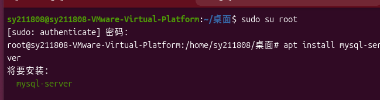
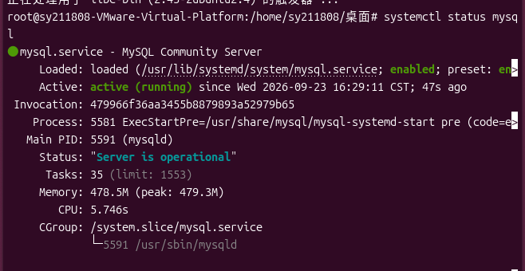
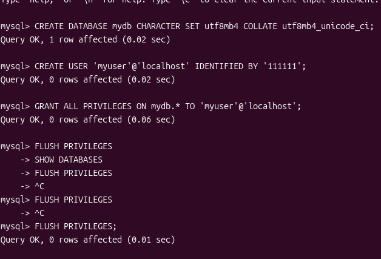
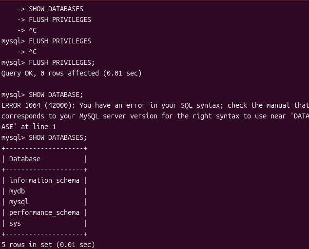
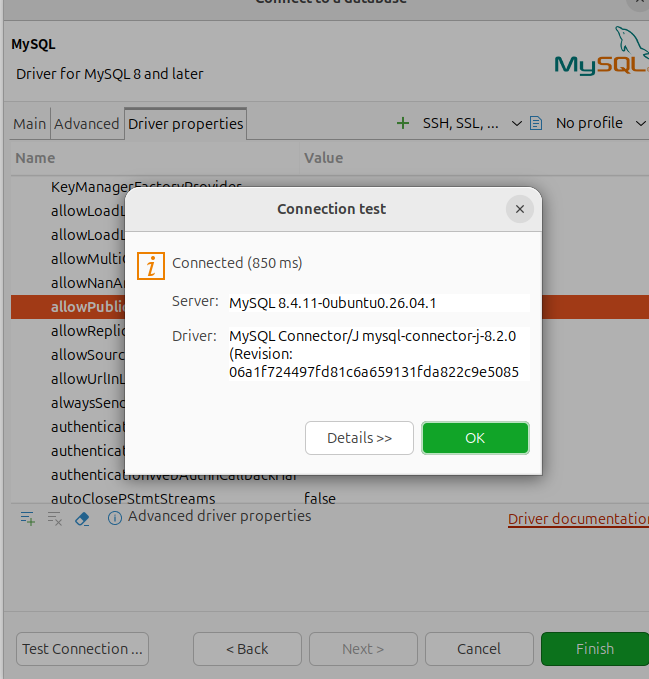

# 搭建第3个服务器 MySQL服务器 - 作业清单

**目标**：搭建并配置一个基础的 MySQL 服务器

> **提示**：以下命令请逐段复制到终端执行。带 `>` 符号的命令需在进入 MySQL 控制台后执行。

---

### 准备工作
- [ ] 确保终端已打开，并且拥有管理员权限（参考顶部残留提示：`apt install openssh-server` 或许已完成）。

### 步骤1：切换管理员权限
- [ ] 在终端输入以下命令切换到 root 用户：
  `sudo su root`

### 步骤2：安装 MySQL 服务
- [ ] 执行以下命令安装 MySQL 服务器：
  `apt install mysql-server`
  

### 步骤3：查看服务状态
- [ ] 检查 MySQL 服务是否成功启动：
  `systemctl status mysql`
  

### 步骤4：进入 MySQL 并执行初始化 SQL 语句
- [ ] 在终端输入以下命令进入 MySQL 控制台（默认 root 无密码或使用系统认证）：
  `mysql`
- [ ] 依次在 MySQL 控制台中执行以下 SQL 语句（注意分号）：
  - [ ] 创建数据库：
    `CREATE DATABASE mydb CHARACTER SET utf8mb4 COLLATE utf8mb4_unicode_ci;`
  - [ ] 创建用户：
    `CREATE USER 'myuser'@'localhost' IDENTIFIED BY '111111';`
  - [ ] 授予用户权限：
    `GRANT ALL PRIVILEGES ON mydb.* TO 'myuser'@'localhost';`
  - [ ] 刷新权限：
    `FLUSH PRIVILEGES;`
  - [ ] 查看数据库列表（验证创建结果）：
    `SHOW DATABASES;`
  - [ ] 退出 MySQL 控制台：
    `exit`
    
    

### 步骤5：安装浏览工具
- [ ] 执行以下命令安装 DBeaver 工具：
  `snap install dbeaver-ce --classic`
- [ ] 安装完成后，使用以下信息进行连接：
  - **用户**：`myuser`
  - **密码**：`111111`
  - **主机**：`localhost`

### 拓展任务（自行研究）
- [ ] 如果希望通过 Windows 直接访问此数据库，请研究如何配置 MySQL 配置文件（通常为 `mysqld.cnf`，修改 `bind-address`）以及如何配置服务器防火墙。
