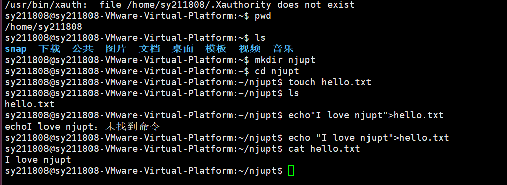

# 搭建第一个服务器 (openssh-server) 作业完成清单

**🎯 目标：** 搭建 SSH 服务器，允许远程访问

---

- [ ] **步骤 1：安装 SSH 服务**
  - 执行命令：`apt install openssh-server`
  - *说明：一条命令即可完成安装。*
  

- [ ] **步骤 2：查询虚拟机 IP 地址**
  - 执行命令：`ifconfig`
  - 记录获取到的 IP 地址（如图中示例：`192.168.149.128`）
  

- [ ] **步骤 3：使用远程连接工具连接虚拟机**
  - 工具选择：使用 PuTTY、Xshell、SecureCRT 等工具连接虚拟机。
  - 连接配置（参考图片右侧 PuTTY 截图）：
    - Host Name (or IP address): `192.168.149.128`
    - Port: `22`
    - Connection type: `SSH`
  - *说明：连接成功后，之后所有操作都在物理机上进行。*
  

- [ ] **步骤 4：依次使用基础 Shell 命令**
  - [ ] 查看当前路径：`pwd`
  - [ ] 查看目录内容：`ls`
  - [ ] 创建新目录：`mkdir njupt`
  - [ ] 进入该目录：`cd njupt`
  - [ ] 创建空白文件：`touch hello.txt`
  - [ ] 再次查看目录确认文件创建：`ls`
  - [ ] 向文件中写入内容：`echo "I love njupt" > hello.txt`
  - [ ] 查看文件内容：`cat hello.txt`
  

---
**💡 备注：** 以上命令执行完毕后，即表示本次搭建与基础操作任务全部完成。